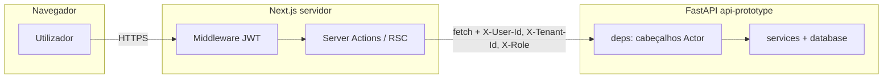

# Relatório de segurança — ALIEH (protótipo web + API)

**Âmbito:** `web-prototype/` (Next.js App Router), `api-prototype/` (FastAPI), integração com o motor existente (`services/`, `database/`, etc.).  
**Data:** 2026-05-03.  
**Última actualização deste documento:** 2026-05-03 — secção **15.1** (cache global no cliente); **endurecimento de deploy** (tier `ALIEH_ENV`, `instrumentation.ts` no Next, middleware opcional **`API_PROTOTYPE_INTERNAL_SECRET`** / **`API_PROTOTYPE_TRUSTED_ORIGINS`**, `GET /metrics` com token em produção, workflow **`production-readiness`**); secções **19–20** (QA/SDET + checklist); **corrida de testes** em **`RELATORIO_QA_READINESS.md`**.  
**Tipo de documento:** avaliação técnica com base no **código e configuração observáveis** no repositório; **não** substitui pentest, revisão de dependências automatizada contínua nem auditoria legal/compliance formal.

---

## 1. Resumo executivo

O protótipo separa **UI (Next)** e **API (FastAPI)**. A autenticação do utilizador concentra-se no **Next** (cookie **httpOnly** com JWT HS256). A API **não** valida passwords nem OAuth: confia nos cabeçalhos **`X-User-Id`**, **`X-Tenant-Id`**, **`X-Role`** (e opcionalmente **`X-Username`**) enviados pelo servidor Next nas chamadas `fetch` server-side. Isto define um **limite de confiança crítico**: a API deve ser tratada como **serviço interno** (rede privada, firewall, ou reforço futuro com assinatura/mTLS), **não** como API pública genérica.

Pontos fortes observáveis:

- Sessão com **`httpOnly`**, **`sameSite: lax`**, **`secure`** em produção; segredo JWT com comprimento mínimo no código.
- Verificação de password com **PBKDF2** e comparação **timing-safe** (`lib/auth/password.ts`); login legacy opcional também com `timingSafeEqual` para user/password fixos.
- **RBAC** em camadas (middleware Next, `gateMutation` / `requireOperator` / `requireAdmin` no Next, `get_actor` / `get_actor_read` / `get_admin_actor` na API).
- **Vendas:** `POST /sales/submit` com **`Idempotency-Key` obrigatório** (até 128 caracteres), preview interno + **`expected_*`**, idempotência persistida com TTL; **rate limiting** em preview e mutações de venda; invalidação de cache de leitura após sucesso.
- **Escritas de inventário** com rate limit dedicado (`rate_limit.py`).
- **Auditoria:** eventos autenticados via `POST /audit/events`; trilha de login **pré-sessão** com segredo partilhado **`X-Prototype-Audit-Secret`**.
- **Storage:** apenas **URLs assinadas** para tipos MIME de imagem permitidos; nome de ficheiro saneado; bucket validado por regex.
- **Erros 500** na API: resposta JSON genérica sem stack trace ao cliente (`main.py`).
- **Health** com timeout em sondas de BD; **correlação** `X-Request-Id` e logs de acesso em JSON.
- **Produção (Next):** `assertProductionServerEnv()` no arranque (`instrumentation.ts`) — exige `AUTH_SESSION_SECRET` (≥32), `API_PROTOTYPE_URL`, `DATABASE_URL`; **rejeita** `ALIEH_PROTOTYPE_OPEN=1` em tier produção. **`isPrototypeOpenEffective()`** ignora modo aberto em produção mesmo com env incorrecta.
- **API (opcional):** segredo interno **`X-Alieh-Internal`** (espelhado no Next via `API_PROTOTYPE_INTERNAL_SECRET`); lista **`API_PROTOTYPE_TRUSTED_ORIGINS`**; **`GET /metrics`** só com `?token=` em produção.

Riscos e lacunas a planear explicitamente:

- **Confiança nos cabeçalhos da API** se a API estiver exposta à Internet sem camada adicional.
- **`ALIEH_PROTOTYPE_OPEN=1`:** desactiva a exigência de login no middleware e altera resolução de tenant/papel — **apenas desenvolvimento/staging**; em **produção** o Next trata como **fechado**.
- Cookies **`alieh_tenant`** / **`alieh_role`** usados em fallbacks quando não há sessão (ver secção 4).
- **Service role** do Supabase na API (poder elevado) — variáveis de ambiente e rede devem ser estritamente controladas.

---

## 2. Metodologia e limites

| Item | Descrição |
|------|-----------|
| Fonte | Leitura estática de ficheiros-chave: `middleware.ts`, `lib/api-prototype.ts`, `lib/auth/*`, `lib/tenant.ts`, `lib/rbac.ts`, `api-prototype/deps.py`, `main.py`, `rate_limit.py`, `routes/sales.py`, `routes/audit.py`, `routes/storage.py`, `prototype_observability.py`, acções de login. |
| Fora de âmbito | Código completo de **todos** os repositórios `database/` e `services/` (avaliação pontual apenas onde a API delega); configuração real de deploy; políticas Supabase RLS no dashboard; scans CVE em tempo real. |
| Recomendação | Complementar com **teste de penetração**, **SAST/DAST** em CI, e revisão de **políticas de retenção** de dados (LGPD) alinhada ao negócio. |

---

## 3. Arquitetura e limites de confiança (trust boundaries)

- **Fronteira 1 (browser ↔ Next):** cookie de sessão; formulários e Server Actions do Next (protecção CSRF do mecanismo de Server Actions do React/Next quando aplicável).
- **Fronteira 2 (Next ↔ API):** não há, no código analisado, **JWT assinado pela API** nem mTLS: a identidade é transportada em **cabeçalhos HTTP**. Quem conseguir enviar pedidos HTTP à API com cabeçalhos válidos será tratado como esse actor.
- **Implicação:** em produção, a API deve estar **atrás de rede privada** (VPC, Docker internal, sidecar) ou protegida por **API gateway** com autenticação forte entre Next e API. Expor `API_PROTOTYPE_URL` publicamente sem estes controlos **anula** a garantia de identidade dos cabeçalhos.

---

## 4. Autenticação e sessão (Next.js)

| Control | Implementação / notas |
|-----------|------------------------|
| Cookie de sessão | `SESSION_COOKIE_NAME` (`lib/auth/constants.ts`); opções em `sessionCookieOptions()`: **`httpOnly: true`**, **`sameSite: "lax"`**, **`path: "/"`**, **`maxAge` 7 dias**, **`secure: true`** quando `NODE_ENV === "production"`. |
| Formato do token | JWT HS256 (`jose`), claims `uid`, `sub`, `role`, `tid`; expiração **7d** (`jwt-core.ts`). |
| Segredo | `AUTH_SESSION_SECRET`; validação **mínimo 16 caracteres** em `getJwtSecretBytes()` (falha explícita se curto ou ausente no sign). |
| Middleware | Se não `ALIEH_PROTOTYPE_OPEN=1`, rotas (exceto assets e `/login`) exigem cookie + verificação **`verifySessionTokenEdge`**. |
| Login | `login` em `lib/actions/auth.ts`: utilizadores em BD (`fetchUserByUsername` + `verifyPbkdf2Password`) ou credencial **legacy** por env; ingestão de auditoria de falhas/sucessos. |
| Logout | Server action que remove cookie (ver fluxo em `auth.ts` completo no repo). |

**Atenção — cookies auxiliares:** `resolveTenantId()` e `resolveRole()` (`lib/tenant.ts`) podem ler **`alieh_tenant`** e **`alieh_role`** quando não há sessão. Em modo **não** aberto, o middleware já exige JWT válido para páginas protegidas; ainda assim, qualquer lógica futura que confie nestes cookies **sem** alinhar à sessão pode introduzir inconsistência. Recomenda-se **fonte única de verdade** = claims do JWT após login, e cookies de papel/tenant apenas como espelho controlado ou remoção gradual.

---

## 5. Modo protótipo aberto (`ALIEH_PROTOTYPE_OPEN=1`)

| Comportamento | Risco |
|----------------|--------|
| Middleware **não** exige sessão para rotas protegidas. | Qualquer visitante acede à UI como se fosse autenticado ao nível de navegação. |
| `prototypeAuthHeaders` / `prototypeAuthHeadersRead` usam **`API_PROTOTYPE_USER_ID`** (obrigatório se não há `userId` na sessão) e papel por **`ALIEH_PROTOTYPE_DEFAULT_ROLE`**. | Todas as chamadas à API agem como esse utilizador fictício. |
| `gateMutation` / `requireOperator` retornam **null** (sem bloqueio) em modo aberto, **exceto** padrões que usam `requireAdminForPricing` quando há auth configurada. | Mutações na UI podem parecer “abertas” dependendo da action. |

**Recomendação:** nunca definir `ALIEH_PROTOTYPE_OPEN=1` em ambientes com dados reais ou expostos à Internet. Tratar como **flag exclusivamente local**.

---

## 6. Autorização (RBAC)

### 6.1 Next.js (`lib/rbac.ts`, `gateMutation` em `lib/api-prototype.ts`)

- **`gateMutation()`:** apenas `admin` e `operator` (`canMutate` em `lib/tenant.ts`).
- **`requireAdmin` / `requireOperator`:** em modo aberto com auth configurada, comportamentos documentados no código (ex.: precificação exige **admin** se existem utilizadores, mesmo com protótipo aberto — `requireAdminForPricing`).

### 6.2 API (`api-prototype/deps.py`)

| Dependência | Papéis |
|-------------|--------|
| `get_actor` | `admin`, `operator` apenas (mutações). |
| `get_actor_read` | `admin`, `operator`, `viewer`. |
| `get_admin_actor` | exige `admin`. |

Papéis inválidos → **403**; `X-User-Id` vazio → **400**.

---

## 7. Multi-tenancy (`X-Tenant-Id`)

- O tenant enviado à API vem de **`resolveTenantId()`** (sessão JWT `tid`, cookie `alieh_tenant`, ou `ALIEH_TENANT_ID` / default em `tenant-env`).
- Na API, `Actor.tenant_id` propaga-se aos serviços/repositórios — a **isolamento efectivo** depende de **todas** as queries no motor respeitarem `tenant_id` (assumido no desenho do monorepo; não foi feita auditoria linha-a-linha de `services/` neste relatório).

**Recomendação:** testes automatizados de **cross-tenant** (utilizador do tenant A nunca lê/escreve dados do tenant B) sobre endpoints críticos.

---

## 8. Integridade e consistência — vendas e stock

| Mecanismo | Descrição |
|-----------|-----------|
| **`POST /sales/submit`** | Orquestração única: `preview_record_sale` → `record_sale` com **`expected_unit_price`**, **`expected_final_total`**, **`expected_discount_amount`** derivados do preview interno. |
| **`Idempotency-Key`** | Obrigatório no submit; truncado a **128** caracteres; armazenamento com TTL e purge (`database/sale_idempotency.py`, lifespan + tarefa horária). |
| **Conflitos** | Respostas **409** com `detail` estruturado (`idempotency_conflict`, `preview_stale`) — o Next já trata `detail.message` em `readApiError`. |
| **Stock sob concorrência** | Documentado no relatório de protótipo: `FOR UPDATE` e `UPDATE` condicional a stock suficiente na camada de persistência de vendas. |
| **`POST /sales/record`** | Mantido para integrações; `Idempotency-Key` opcional; mesmo rate limit de mutação de venda. |
| **Rate limits** | `_rate_sale_preview_or_raise`: até **120** previews por janela; `_rate_sale_mutation_or_raise`: `PROTOTYPE_RATE_LIMIT_SALE_MUTATIONS` (default **24** por janela); janela `PROTOTYPE_RATE_LIMIT_WINDOW_SEC` (mín. **10** s, default **60** s). |
| **Cache de leitura** | Invalidação após vendas bem-sucedidas (`_invalidate_sale_reads`). |

---

## 9. Inventário e outros escritos

- Rotas de inventário com mutações utilizam `get_actor` e **`_rate_write_mutation_or_raise`** (ou equivalente) com limite **`PROTOTYPE_RATE_LIMIT_WRITE_MUTATIONS`** (default **60** por janela) — ver `routes/inventory.py` no repositório.
- Validação de entrada via **Pydantic** nos routers onde aplicável.

---

## 10. Auditoria

| Endpoint | Autenticação | Função |
|----------|--------------|--------|
| `POST /audit/events` | `Depends(get_actor)` | Append-only de eventos com `tenant_id`, `user_id`, `domain`, `action`, `detail`. |
| `POST /audit/login-ingest` | Cabeçalho **`X-Prototype-Audit-Secret`** igual a `PROTOTYPE_AUDIT_INGEST_SECRET` | Permite registo **antes** de existir cookie de sessão; se segredo não configurado na API, comparação falha (**401**). |

**Next:** `logPrototypeLoginIngest` só envia se `PROTOTYPE_AUDIT_INGEST_SECRET` e `API_PROTOTYPE_URL` estiverem definidos; falhas silenciosas para não bloquear login.

**Risco residual:** segredo partilhado em texto; rotação periódica e armazenamento em cofre (Vault, Secrets Manager) recomendados.

---

## 11. Armazenamento de ficheiros (Supabase)

(`api-prototype/routes/storage.py`)

- Tipos MIME permitidos: **jpeg, png, webp, gif** apenas.
- **`SUPABASE_SERVICE_ROLE_KEY`**: poder total sobre o projecto Supabase — **nunca** no cliente; apenas servidor API.
- Timeout HTTP configurável (`SUPABASE_HTTP_TIMEOUT_SECONDS`).
- Nome de ficheiro: `basename` + substituição de caracteres perigosos; comprimento máximo.
- Path de upload inclui tenant/uuid (ver restante do ficheiro no repo) para reduzir colisões e facilitar quotas por tenant.

---

## 12. Observabilidade e vazamento de dados em logs

- **`CorrelationAndAccessLogMiddleware`:** gera ou propaga **`X-Request-Id`**; log JSON com `endpoint`, `method`, `actor_id`, `tenant_id`, `role`, `duration_ms`, `status_code`, métricas cumulativas.
- **Vendas:** logs `sale_submit_ok` / `sale_record_ok` com `sale_code`, `product_id`, `customer_id`, `quantity`, `final_total` (dados de negócio — classificar como **dados sensíveis** em políticas de retenção/mascaramento).
- **Erros não tratados:** log no servidor com `exception`; resposta ao cliente **genérica** (`"Erro interno do servidor."`).

**Recomendação:** política de retenção de logs, acesso restrito aos agregadores, e evitar logar payloads completos de pedidos em DEBUG em produção.

---

## 13. Validação de entrada e SQL

- API usa **Pydantic** para corpos JSON (`Field`, `field_validator`, `model_validator` — exemplo `RecordSaleBody` / `PreviewSaleBody` em `routes/sales.py`).
- Acesso a dados via **repositórios** e SQL parametrizado (padrão do projeto; risco de injeção SQL depende da disciplina em **todo** o código `database/` — manter revisões e lint SQL).

---

## 14. Configuração, segredos e variáveis de ambiente

| Variável (exemplos) | Sensibilidade |
|---------------------|----------------|
| `AUTH_SESSION_SECRET` | **Crítica** — compromisso = sessão forjada. |
| `API_PROTOTYPE_URL` | **Alta** — apontar para host errado pode desviar tráfego; o Next valida não usar mesma porta que o Next em localhost. |
| `PROTOTYPE_AUDIT_INGEST_SECRET` | **Alta** — permite injestar eventos de login. |
| `SUPABASE_SERVICE_ROLE_KEY` | **Crítica**. |
| `ALIEH_AUTH_USERNAME` / `ALIEH_AUTH_PASSWORD` | **Alta** (legacy). |
| `DATABASE_URL` / DSN | **Crítica** (no motor Python / Next se usado). |
| `PROTOTYPE_RATE_LIMIT_*` | **Média** — tuning de abuso, não segredo. |

**Boas práticas:** `.env` / `.env.local` em `.gitignore`; segredos apenas em cofre; rotação; princípio do menor privilégio para contas de BD.

---

## 15. Cliente Next — chamadas à API

- **`server-only`** em `api-prototype.ts` — evita import acidental no bundle do browser para credenciais de servidor.
- **Cabeçalhos** montados apenas no servidor a partir da sessão (não expostos ao cliente como padrão de código analisado).

**ViaCEP / terceiros:** timeout **8 s** no bloco de CEP (reduz janela de bloqueio; não elimina risco de endpoint externo — confiar em HTTPS).

### 15.1 Cache global no cliente (Zustand / Server Action de leitura)

- **`loadGlobalReadBundleAction`** (`lib/actions/client-data-bootstrap.ts`): Server Action que corre **no servidor** e reutiliza os mesmos helpers `fetchPrototype*` (`apiPrototypeFetchRead` / `apiPrototypeFetch`) — **não** envia segredos ao browser além do que já transitava nas páginas RSC; respeita sessão e RBAC do Next ao chamar a API.
- **`lib/client-data/store.ts`**: estado em **memória do browser** (TTL ~120 s para leituras agregadas; lotes por SKU com dedupe). **Risco residual:** vista ligeiramente *stale* após mutação noutro separador ou utilizador — mitigado por TTL, `invalidateAllBatches` após venda, e **validação definitiva sempre na API** nas mutações.
- **Dependência `zustand`:** incluir em `npm audit` / renovação de dependências como o resto do `web-prototype`.

---

## 16. Health e superfície de informação

- **`GET /health`** expõe estado agregado, latências, lista `sales_paths` — útil para orquestração; pode revelar versão de rotas. **Recomendação:** não expor publicamente sem autenticação ou IP allowlist se o detalhe for considerado sensível.

---

## 17. Matriz de riscos (sintética)

| ID | Risco | Severidade | Probabilidade | Mitigação / estado |
|----|--------|------------|---------------|---------------------|
| R1 | API acessível na Internet sem redestrita | Crítica | Média | Firewall / private link; gateway com auth app-to-app. |
| R2 | `ALIEH_PROTOTYPE_OPEN=1` em produção | Crítica | Baixa | Processo de deploy + validação de env. |
| R3 | Vazamento de `AUTH_SESSION_SECRET` ou service role | Crítica | Baixa | Cofre, rotação, auditoria de acesso. |
| R4 | Bypass de tenant em query mal escrita no motor | Alta | Baixa | Testes cross-tenant + revisão de repositórios; ver também suite `tests/api` + `RELATORIO_COMPLETO_TESTES.md` (evolução planeada). |
| R5 | Abuso de preview / vendas | Média | Média | Rate limits já presentes; ajustar limites por ambiente. |
| R6 | Logs com PII excessiva | Média | Média | Política de mascaramento/retention. |

---

## 18. Recomendações priorizadas

1. **Rede:** Garantir que **apenas** o runtime Next (ou workers de confiança) consegue chamar a `api-prototype` em produção; documentar arquitectura no runbook.
2. **Identidade app-to-app:** Avaliar **JWT de curta duração** assinado pelo Next e validado na FastAPI, ou **mTLS**, em vez de confiar só em cabeçalhos num canal não autenticado.
3. **Modo aberto:** **Implementado** no Next (`isPrototypeOpenEffective` + `assertProductionServerEnv`); manter checklist de deploy e **nunca** definir `ALIEH_PROTOTYPE_OPEN=1` em variáveis de produção.
4. **Cookies `alieh_*`:** Revisar necessidade vs JWT; reduzir superfície de confusão tenant/papel.
5. **Dependências:** `npm audit` / `pip-audit` em CI; pin de versões críticas.
6. **CSP / headers HTTP:** Revisar `next.config` para **Content-Security-Policy**, **HSTS**, **X-Frame-Options** / frame-ancestors conforme política da organização.
7. **LGPD:** Mapear dados pessoais (clientes, logs); base legal; retention; DSR — documento à parte com jurídico.
8. **CI de segurança regressiva:** workflow **`production-readiness`** (Postgres efémero, API, Next, `pytest` + `live_api` com URL, integração Postgres, Playwright com seed **`scripts/ci/seed_e2e_user.py`**); **`tests/conftest.py`** falha `live_api` em **CI** sem `ALIEH_API_TEST_URL`. Nunca apontar para produção directa.

---

## 19. Validação automatizada (QA / SDET) — alinhamento com controlos

No repositório existe uma **primeira camada** de testes HTTP (`tests/api/`, marcador `live_api`) e regressão Python (`tests/test_*.py`). Estes testes **não** substituem pentest nem provam RLS no Supabase, mas reforçam controlos documentados acima:

| Control de segurança (este relatório) | Cobertura automatizada relevante |
|---------------------------------------|----------------------------------|
| **Superfície `/health`** e versão de rotas | Os testes `live_api` exigem *fingerprint* JSON com `sales_paths` e `dependencies` — se `ALIEH_API_TEST_URL` apontar para outro serviço na mesma porta, os casos **saltam** (evita falso verde). |
| **RBAC na API** (`get_actor` vs `get_actor_read`) | `tests/api/test_rbac_live_api.py`: leitor `viewer` em `GET /sales/saleable-skus`; `POST /sales/preview` com `viewer` → **403**; `X-User-Id` ausente → **400/422**. |
| **`Idempotency-Key` obrigatório em `POST /sales/submit`** | `tests/api/test_sales_contract_live_api.py`: submit sem cabeçalho → **400** e mensagem coerente. |
| **Erros JSON sem stack** | Validado por código em `main.py`; os testes API verificam códigos e corpos JSON em caminhos felizes/rejeitados, não HTML de erro genérico em `/health` quando a API é a correcta. |

**Limitações explícitas:** não há ainda testes automatizados de **cross-tenant** nem prova de **firewall** real; a **camada Zustand** no Next **não** tem testes dedicados (ver matriz em **`RELATORIO_COMPLETO_TESTES.md`**). O **`RELATORIO_QA_READINESS.md`** consolida GO/NO-GO e o **registo da última execução** (2026-05-03: 72 passed / 1 skipped regressão; 7 skipped API live sem URL; Playwright **2 passed / 5 skipped** em `flows.spec.ts`; `test:pg` 1 skipped).

---

## 20. Checklist rápido (go-live)

- [ ] `ALIEH_PROTOTYPE_OPEN` **desligado** em produção.  
- [ ] `AUTH_SESSION_SECRET` forte e exclusivo por ambiente.  
- [ ] API não exposta publicamente sem camada adicional.  
- [ ] `PROTOTYPE_AUDIT_INGEST_SECRET` definido e rotacionável.  
- [ ] Supabase keys apenas no servidor; bucket e políticas RLS revistas.  
- [ ] Rate limits calibrados para carga esperada.  
- [ ] Health e métricas atrás de controlo de acesso.  
- [ ] HTTPS end-to-end; cookies `Secure` em produção (já alinhado ao `NODE_ENV`).  
- [ ] Plano de resposta a incidentes e revisão de logs de segurança.  
- [ ] Pipeline com `pytest` (regressão + `live_api` contra ambiente espelho) e, quando aplicável, E2E Playwright (`tests/e2e`).

---

*Fim do relatório de segurança.*
